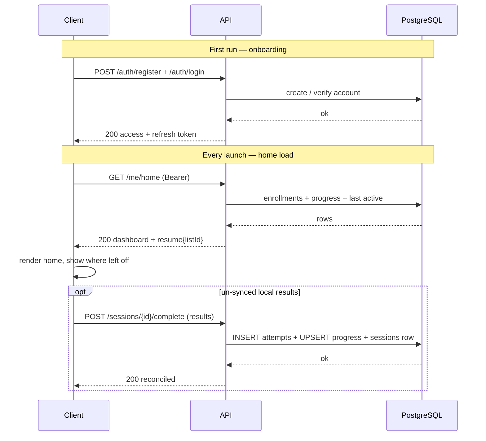
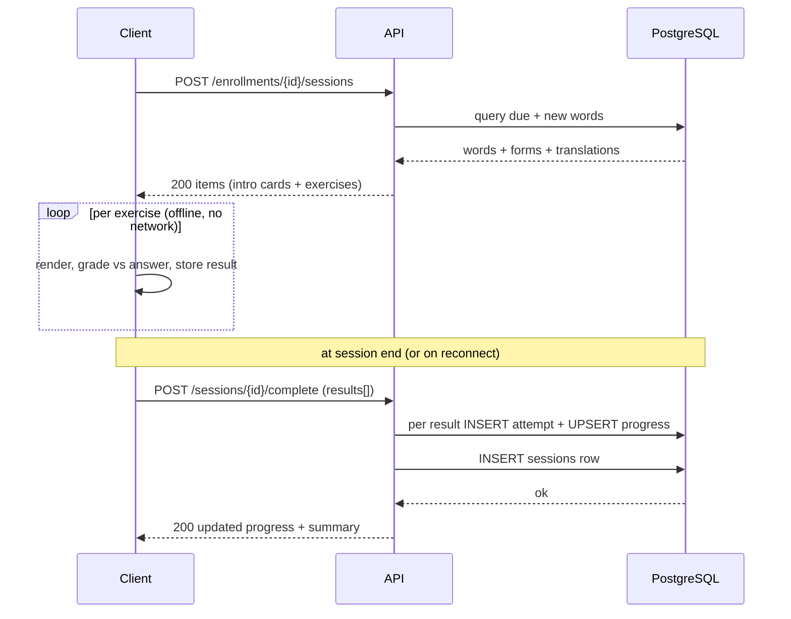

# API design

App-only REST API (React Native client, Spring Boot server). No public API. See [[Technical]], [[Data structure]].

## Conventions

- **JSON, camelCase** everywhere.
- **Plural resource nouns**; nest only under a real parent (`/enrollments/{listId}/sessions`).
- **HTTP status is the source of truth**; the error body elaborates.
- **Idempotent** enroll and result-submission (mobile networks retry).
- **Shuffling is server-side, always** (letters, options) so answer position carries no signal. The client renders in received order and never re-sorts.
- **Payload carries instance data only.** Everything constant-per-type (instruction labels, button text) and everything locale-dependent (their translations) is owned by the client. The server never sends UI copy.
- **Grading is client-side.** The exercise payload includes the correct answer; the client grades locally and submits the result for tracking. The server trusts `isCorrect` and logs it.

## Auth

- **JWT bearer tokens**: `Authorization: Bearer <access_token>` on every call except login/refresh.
- **Access token** (~15–30 min) + **refresh token** (~30 days).
- **User id is derived from the validated token subject — never from the body or path.** "My" endpoints (`/me/home`, `/enrollments`) infer the user from the token and carry no user id in the URL.

|Method|Path|Purpose|
|---|---|---|
|POST|`/auth/register`|create account|
|POST|`/auth/login`|email + password → tokens|
|POST|`/auth/refresh`|refresh token → new access token|
|POST|`/auth/logout`|invalidate refresh token|

## Catalog (language data)

|Method|Path|Purpose|
|---|---|---|
|GET|`/languages`|supported languages|
|GET|`/lists?target=sv&base=en`|curated lists for a language pair|
|GET|`/lists/{listId}`|list detail (name, size, allowedExercises)|

`/lists` filters by (base, target); the server returns only pairs with translation coverage, so supported combos are emergent from data, not a declared list.

## Enrollment (user_list)

"Enrollment" = one [[user_list]] row. "Enroll" = create that row (a reference, not a copy of the list's words).

|Method|Path|Purpose|
|---|---|---|
|POST|`/lists/{listId}/enroll`|enroll current user; body carries `baseLang`. Idempotent.|
|GET|`/enrollments`|current user's enrollments + progress summary|
|GET|`/enrollments/{listId}`|one enrollment: sessions done/total, % complete|
|DELETE|`/enrollments/{listId}`|un-enroll|

## Session + results (the core loop)

|Method|Path|Purpose|
|---|---|---|
|POST|`/enrollments/{listId}/sessions`|derive a session on demand → return an ordered items array (intro cards + exercises, with answers)|
|POST|`/sessions/{sessionId}/complete`|close the session; body carries the results array (INSERT attempts + UPSERT progress + INSERT sessions row, one transaction)|
|POST|`/sessions/{sessionId}/answers`|_optional_ incremental sync of a results batch during a long session|

A session is **created (POST), not fetched** — it is computed fresh from due + new words each time; there is no cacheable GET. For MVP, `complete` carrying the results is enough; keep `answers` only if you want mid-session incremental sync.

## Progress / home

|Method|Path|Purpose|
|---|---|---|
|GET|`/me/home`|aggregate: profile + enrollments + progress + resume pointer|
|GET|`/enrollments/{listId}/progress`|per-word progress for a list|
|GET|`/me/stats`|overall: distinct words known, streak|

`/me/home` renders the dashboard in one round trip and returns `resume.listId` (the last-active enrollment). There is **no half-finished session to restore from the server** — sessions are derived, and only completed ones are logged. "Resume" = reopen the last-active list and generate the next session. Un-synced answers from an interrupted session live in device storage and are reconciled on launch.

---

## Session items

A session response is an ordered `items` array, not a bare exercise list. Each item is one of two kinds, discriminated by `itemType`:

- **`introduce`** — a no-action teaching card (word + translation + full paradigm). The client renders it with a **Next** button. Never graded, never logged.
- **`exercise`** — a graded task (the payload structure below).

`itemType` (what the client renders) is distinct from `exerciseType` (what gets graded and logged). **`introduce` is NOT an `exerciseType`** — it never enters the `exercise_type` enum, and it never produces an [[attempt]] row.

The **order of `items` encodes the pedagogy**: an intro card appears just-in-time before a new word's first task; that word's tasks are then spaced and interleaved with other words' tasks. The client renders the array top to bottom and does not reorder. Example flow for three words: `w1-intro → w1-t1 → w1-t2 → w2-intro → w2-t1 → w1-t3 → w2-t2 → w3-intro …`. A word gets an intro card when it has no [[list_progress]] row yet (the "not started" signal).

### Introduce card

Carries the composed citation `word` (article/marker included, server-side), the `translation` in the enrollment base language, and the full labelled paradigm. Assembled from `lexeme` + `word_form` + `translation` — no new storage, nothing logged on view.

```json
{
  "itemId": "it_01",
  "itemType": "introduce",
  "lexemeId": 3,
  "card": {
    "word": "att gå",
    "lemma": "gå",
    "pos": "verb",
    "gender": null,
    "translation": "to go, to walk",
    "forms": [
      { "formType": "infinitive", "form": "gå" },
      { "formType": "present", "form": "går" },
      { "formType": "preteritum", "form": "gick" },
      { "formType": "supine", "form": "gått" },
      { "formType": "imperative", "form": "gå" },
      { "formType": "present_participle", "form": "gående" },
      { "formType": "past_participle", "form": "gången" }
    ]
  }
}
```

`forms` uses `formType` codes, not display labels — the client localizes labels. Order is paradigm order.

## Exercise payload structure

An `exercise` item has three layers:

- **envelope** — `itemId`, `itemType: exercise`, `exerciseType`, `lexemeId`, `formType`
- **prompt** — what the user is shown (the question stem): `{ text, lang }`
- **exercise** — the answer mechanism (options / letters) + the correct answer

`lang` lives in `prompt`, not at root: a translation exercise spans two languages (prompt in one, options in another), so a single root `lang` cannot represent it. The answer side declares its own language (`optionsLang`) when it differs.

`prompt` is minimal: `{ text, lang }`. Instruction labels ("Give the base form") are constant per `exerciseType` and localized by the client from its own UI locale — not sent in the payload. `formType` (in the envelope) tells the client which form is asked when it needs to show that.

### Session response (mixed items)

```json
{
  "sessionId": "s_a3f2c9",
  "listId": 1,
  "items": [
    {
      "itemId": "it_01",
      "itemType": "introduce",
      "lexemeId": 3,
      "card": {
        "word": "att gå",
        "lemma": "gå",
        "pos": "verb",
        "gender": null,
        "translation": "to go, to walk",
        "forms": [
          { "formType": "infinitive", "form": "gå" },
          { "formType": "present", "form": "går" },
          { "formType": "preteritum", "form": "gick" },
          { "formType": "supine", "form": "gått" }
        ]
      }
    },
    {
      "itemId": "it_02",
      "itemType": "exercise",
      "lexemeId": 3,
      "exerciseType": "translate",
      "formType": null,
      "prompt": { "text": "gå", "lang": "sv" },
      "exercise": {
        "optionsLang": "en",
        "options": ["to go", "to run", "to stand", "to sit"],
        "correctAnswer": "to go"
      }
    },
    {
      "itemId": "it_03",
      "itemType": "introduce",
      "lexemeId": 1,
      "card": {
        "word": "ett hus",
        "lemma": "hus",
        "pos": "noun",
        "gender": "ett",
        "translation": "house",
        "forms": [
          { "formType": "indef_sg", "form": "hus" },
          { "formType": "def_sg", "form": "huset" },
          { "formType": "indef_pl", "form": "hus" },
          { "formType": "def_pl", "form": "husen" }
        ]
      }
    },
    {
      "itemId": "it_04",
      "itemType": "exercise",
      "lexemeId": 1,
      "exerciseType": "en_ett",
      "formType": null,
      "prompt": { "text": "hus", "lang": "sv" },
      "exercise": {
        "options": ["en", "ett"],
        "correctAnswer": "ett"
      }
    }
  ]
}
```

Intro items carry a `card` and no `exerciseType`/`prompt`/`exercise`; exercise items carry `exerciseType`/`prompt`/`exercise` and no `card`. The client switches on `itemType`.

### Per-type `exercise` object

Each type declares exactly the answer shape it needs. `options` is the pre-shuffled full set including the correct answer; the client renders it directly and grades the tap against `correctAnswer`.

**en_ett** — pick the article

```json
{
  "itemId": "it_01",
  "itemType": "exercise",
  "exerciseType": "en_ett",
  "lexemeId": 1,
  "formType": null,
  "prompt": {
    "text": "hus",
    "lang": "sv"
  },
  "exercise": {
    "options": [
      "en",
      "ett"
    ],
    "correctAnswer": "ett"
  }
}
```

**translate** — pick the translation (direction shown by prompt.lang vs optionsLang)

```json
{
  "itemId": "it_02",
  "itemType": "exercise",
  "exerciseType": "translate",
  "lexemeId": 1,
  "formType": null,
  "prompt": {
    "text": "hus",
    "lang": "sv"
  },
  "exercise": {
    "optionsLang": "en",
    "options": [
      "house",
      "car",
      "tree",
      "dog"
    ],
    "correctAnswer": "house"
  }
}
```

**assemble** — build from shuffled letters with decoys

```json
{
  "itemId": "it_03",
  "itemType": "exercise",
  "exerciseType": "assemble",
  "lexemeId": 3,
  "formType": "preteritum",
  "prompt": {
    "text": "to go",
    "lang": "en"
  },
  "exercise": {
    "letters": [
      "k",
      "a",
      "c",
      "g",
      "i",
      "k",
      "n"
    ],
    "answerLength": 4,
    "correctAnswer": "gick"
  }
}
```

Letters are longer than the answer (~1.5x), shuffled, may contain duplicates; treat as an ordered array (positional), not a set. Decoys drawn from the target-language alphabet (include å/ä/ö for Swedish) make better distractors than random Latin letters.

**base_form** — given a form, pick the lemma

```json
{
  "itemId": "it_04",
  "itemType": "exercise",
  "exerciseType": "base_form",
  "lexemeId": 3,
  "formType": "preteritum",
  "prompt": {
    "text": "gick",
    "lang": "sv"
  },
  "exercise": {
    "options": [
      "gå",
      "gick",
      "stå",
      "få"
    ],
    "correctAnswer": "gå"
  }
}
```

**produce_form** — given lemma + target form (envelope.formType), produce it

```json
{
  "itemId": "it_05",
  "itemType": "exercise",
  "exerciseType": "produce_form",
  "lexemeId": 3,
  "formType": "preteritum",
  "prompt": {
    "text": "gå",
    "lang": "sv"
  },
  "exercise": {
    "options": [
      "gick",
      "gången",
      "gått",
      "går"
    ],
    "correctAnswer": "gick"
  }
}
```

**multi_select** — pick all correct forms (note plural `correctAnswers`)

```json
{
  "itemId": "it_06",
  "itemType": "exercise",
  "exerciseType": "multi_select",
  "lexemeId": 3,
  "formType": null,
  "prompt": {
    "text": "gå",
    "lang": "sv"
  },
  "exercise": {
    "options": [
      "går",
      "gick",
      "gått",
      "house",
      "springer"
    ],
    "correctAnswers": [
      "går",
      "gick",
      "gått"
    ]
  }
}
```

Distractors for choice types are **same target-language, same pos, near freq_rank**, excluding the answer — mixed-pos distractors are too easy to eliminate. This is where exercise quality lives; each type needs its own distractor-pool query.

### Submit results (in `/complete`)

```json
{
  "results": [
    {
      "itemId": "it_03",
      "lexemeId": 3,
      "exerciseType": "assemble",
      "formType": "preteritum",
      "isCorrect": true,
      "elapsedMs": 4200
    },
    {
      "itemId": "it_01",
      "lexemeId": 1,
      "exerciseType": "en_ett",
      "formType": null,
      "isCorrect": false,
      "elapsedMs": 1800
    }
  ]
}
```

Server loops: per result → 1 INSERT [[attempt]] + 1 UPSERT [[list_progress]]; then 1 INSERT [[sessions]]. Response returns updated per-word progress.

### Home response

```json
{
  "user": {
    "id": 1,
    "email": "demo@example.com"
  },
  "enrollments": [
    {
      "listId": 1,
      "name": "Swedish Basics",
      "baseLang": "en",
      "targetLang": "sv",
      "status": "active",
      "wordsMastered": 1,
      "totalWords": 3,
      "sessions": {
        "done": 1,
        "estimatedTotal": 8
      },
      "lastActiveAt": "2026-07-26T18:40:00Z"
    }
  ],
  "resume": {
    "listId": 1
  }
}
```

## Error format

```json
{
  "error": {
    "status": 400,
    "code": "NO_TRANSLATION_AVAILABLE",
    "message": "No translation exists for this word in the target language",
    "traceId": "req_a3f2c9"
  }
}
```

- `status` — HTTP status number.
- `code` — stable machine-readable string; **clients branch on this**, never on `message`.
- `message` — human text for logs/debugging; free to reword.
- `traceId` — correlate a user report to server logs.

---

## Sequence — onboarding, home load, resume



## Sequence — session loop (client-side grading)


